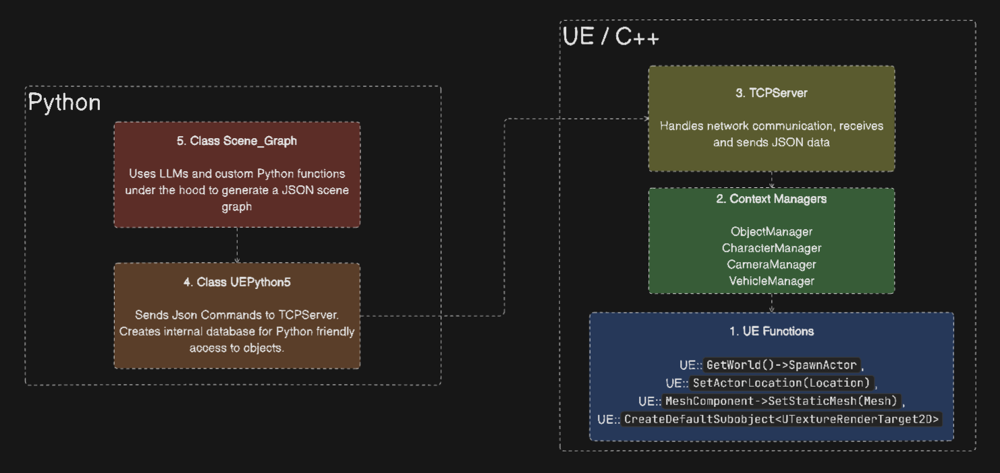

Architecture Diagram
====================

Our architecture design allows us to modify the scene during gameplay, unlike existing Python Unreal Engine APIs.

1. **UE Function** (C++): Basic operations within Unreal Engine are handled by UE Functions. These can be built-in or custom functions that perform specific tasks such as rendering graphics or processing user inputs.

Example UE functions used:

.. code-block:: cpp

   // Create new MyObject Class
   GetWorld()->SpawnActor<AMyObject>(AMyObject::StaticClass(), Location, Rotation, SpawnParams);

   // Set Object Location
   Object->SetActorLocation(Location);

   // Initialize Object Mesh
   UStaticMesh* Mesh = Cast<UStaticMesh>(StaticLoadObject(UStaticMesh::StaticClass(), nullptr, *MeshPath));

   // Set MeshComponent to the Object Mesh
   MeshComponent->SetStaticMesh(Mesh);

   // Create render target for extracting cameras
   RenderTarget = CreateDefaultSubobject<UTextureRenderTarget2D>(TEXT("RenderTarget"));

2. **Context Manager** (C++): To manage objects, cameras, characters, and vehicles efficiently, we use Context Managers. They ensure that resources like network connections or file handles are properly allocated and released, maintaining optimal performance and preventing leaks.

- ObjectManager
- CharacterManager
- CameraManager
- VehicleManager

3. **TCPServer** (C++): Our architecture includes a TCPServer to facilitate real-time communication between the game and external systems or clients. This server handles network protocols and data exchange in JSON format for scene generation and character actions.

Example JSON data:

.. code-block:: json

    {
        "action": "add_object",
        "location": {
            "x": 0,
            "y": 0,
            "z": 0
        },
        "rotation": {
            "pitch": 0,
            "yaw": 0,
            "roll": 0
        },
        "material_path": "Material'/Game/StarterContent/Materials/M_Brick_Clay_New.M_Brick_Clay_New'",
        "mesh_path": "StaticMesh'/Game/StarterContent/Shapes/Shape_Pipe_180.Shape_Pipe_180'",
        "physics": false
    }

4. **Class UEPython5** (Python): We extend Unreal Engine's capabilities using Python scripts through UE Python Classes. These classes define custom behaviors and properties for game objects, enabling flexible and dynamic interactions with the Unreal Engine API.

5. **Class Scene_Graph** (Python): The Scene Graph Modules manage the hierarchy and organization of objects in the game scene. They ensure proper spatial relationships and rendering order, allowing dynamic modifications during gameplay.
